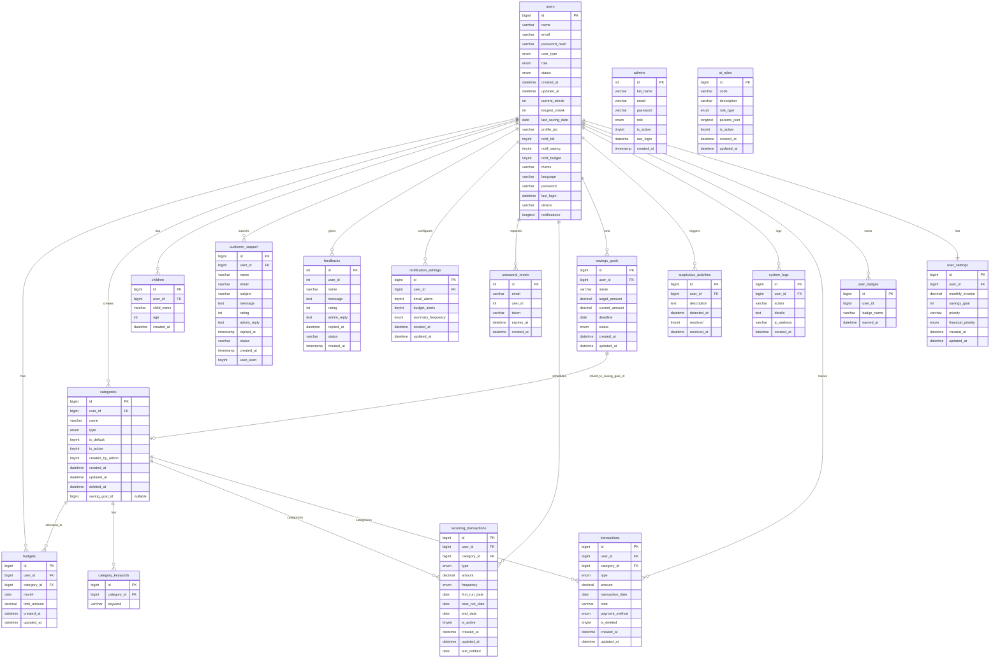

# AMYFI Entity Relationship Diagram (Based on SQL Dump)

```mermaid
erDiagram
    users ||--o{ budgets : "has"
    categories ||--o{ budgets : "allocated_to"
    
    users ||--o{ categories : "creates"
    categories ||--o{ category_keywords : "has"
    
    users ||--o{ children : "has"
    users ||--o{ customer_support : "submits"
    
    users ||--o{ feedbacks : "gives"
    
    users ||--o{ notification_settings : "configures"
    
    users ||--o{ password_resets : "requests"
    
    users ||--o{ recurring_transactions : "schedules"
    categories ||--o{ recurring_transactions : "categorizes"
    
    users ||--o{ savings_goals : "sets"
    savings_goals ||--o| categories : "linked_to_saving_goal_id"
    
    users ||--o{ suspicious_activities : "triggers"
    users ||--o{ system_logs : "logs"
    
    users ||--o{ transactions : "makes"
    categories ||--o{ transactions : "categorizes"
    
    users ||--o{ user_badges : "earns"
    users ||--|| user_settings : "has"

    admins {
        int id PK
        varchar full_name
        varchar email
        varchar password
        enum role
        tinyint is_active
        datetime last_login
        timestamp created_at
    }

    ai_rules {
        bigint id PK
        varchar code
        varchar description
        enum rule_type
        longtext params_json
        tinyint is_active
        datetime created_at
        datetime updated_at
    }

    budgets {
        bigint id PK
        bigint user_id FK
        bigint category_id FK
        date month
        decimal limit_amount
        datetime created_at
        datetime updated_at
    }

    categories {
        bigint id PK
        bigint user_id FK
        varchar name
        enum type
        tinyint is_default
        tinyint is_active
        tinyint created_by_admin
        datetime created_at
        datetime updated_at
        datetime deleted_at
        bigint saving_goal_id "nullable"
    }

    category_keywords {
        bigint id PK
        bigint category_id FK
        varchar keyword
    }

    children {
        bigint id PK
        bigint user_id FK
        varchar child_name
        int age
        datetime created_at
    }

    customer_support {
        bigint id PK
        bigint user_id FK
        varchar name
        varchar email
        varchar subject
        text message
        int rating
        text admin_reply
        timestamp replied_at
        varchar status
        timestamp created_at
        tinyint user_seen
    }

    feedbacks {
        int id PK
        int user_id
        varchar name
        text message
        int rating
        text admin_reply
        datetime replied_at
        varchar status
        timestamp created_at
    }

    notification_settings {
        bigint id PK
        bigint user_id FK
        tinyint email_alerts
        tinyint budget_alerts
        enum summary_frequency
        datetime created_at
        datetime updated_at
    }

    password_resets {
        int id PK
        varchar email
        int user_id
        varchar token
        datetime expires_at
        datetime created_at
    }

    recurring_transactions {
        bigint id PK
        bigint user_id FK
        bigint category_id FK
        enum type
        decimal amount
        enum frequency
        date first_run_date
        date next_run_date
        date end_date
        tinyint is_active
        datetime created_at
        datetime updated_at
        date last_notified
    }

    savings_goals {
        bigint id PK
        bigint user_id FK
        varchar name
        decimal target_amount
        decimal current_amount
        date deadline
        enum status
        datetime created_at
        datetime updated_at
    }

    suspicious_activities {
        bigint id PK
        bigint user_id FK
        text description
        datetime detected_at
        tinyint resolved
        datetime resolved_at
    }

    system_logs {
        bigint id PK
        bigint user_id FK
        varchar action
        text details
        varchar ip_address
        datetime created_at
    }

    transactions {
        bigint id PK
        bigint user_id FK
        bigint category_id FK
        enum type
        decimal amount
        date transaction_date
        varchar note
        enum payment_method
        tinyint is_deleted
        datetime created_at
        datetime updated_at
    }

    users {
        bigint id PK
        varchar name
        varchar email
        varchar password_hash
        enum user_type
        enum role
        enum status
        datetime created_at
        datetime updated_at
        int current_streak
        int longest_streak
        date last_saving_date
        varchar profile_pic
        tinyint notif_bill
        tinyint notif_saving
        tinyint notif_budget
        varchar theme
        varchar language
        varchar password
        datetime last_login
        varchar device
        longtext notifications
    }

    user_badges {
        bigint id PK
        bigint user_id
        varchar badge_name
        datetime earned_at
    }

    user_settings {
        bigint id PK
        bigint user_id FK
        decimal monthly_income
        int savings_goal
        varchar priority
        enum financial_priority
        datetime created_at
        datetime updated_at
    }
```
